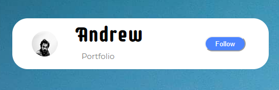

# Portfolio
Resume/Portfolio

This is a simple portfolio using react, and hosted on AWS.

right now I am using flexbox and variable widths to create responsiveness

Utilizes some material_Ui componenets (carrots for descriptions) and is somewhat responsive. 

To do
- Add better projects
- More responsive
- Add dynamic Elements 
